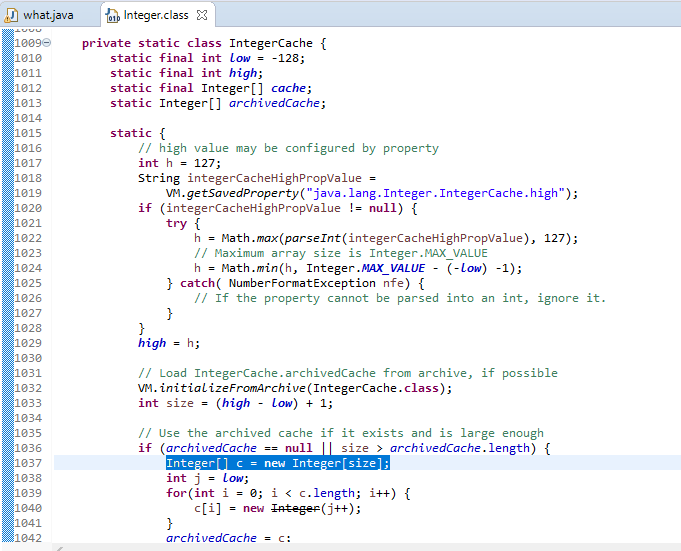

# 2 + 2 = 5 ! :scream:
Here I am trying to output 5 when we add 2 with 2 programmatically. :nerd_face:

## Lets Get Started :rocket::


:exploding_head:
### Explanation
We are using Java's ability of doing [Reflection](https://www.baeldung.com/java-reflection) .
```javascript
Class cache = Integer.class.getDeclaredClasses()[0];
```
Here, from the Integer class we are getting the Integer cache class
```javascript
Integer[] array = (Integer[]) c.get(cache);
```
and put it into an array of size **256** ( in int class low is set to -128 and high is set to 127 ).


In this class it creates a cache of Integer objects, and reuse this cache when int from this range is used.

```javascript
array[132] = array[133];
```
So the 132th element is **4** and 133th element is **5**, we replace 4 with 5, now whenever 4 shows up in my code it will be 5 instead.

---
### Still dont agree with this explination ? :astonished:
Use [this calculator](https://www.noisemeters.asia/apps/db-calculator/)  which gives 2+2=5 using proper formula. :boom:

